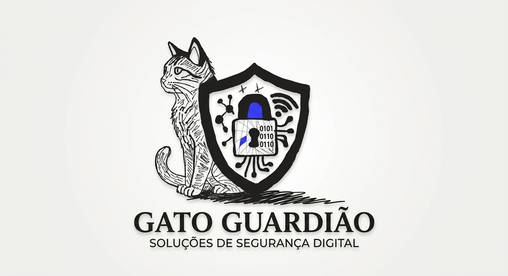

# 🛡️ Plataforma de Cibersegurança Básica



> Plataforma educativa desenvolvida para apresentar conceitos fundamentais de **cibersegurança** de forma simples, prática e acessível.

O projeto tem como objetivo promover a **conscientização sobre segurança digital**, apresentando ameaças comuns, boas práticas de proteção e situações que podem ocorrer no dia a dia.

---

## 📌 Sobre o Projeto

A **Plataforma de Cibersegurança Básica** é um projeto educacional criado para aproximar conceitos de segurança da informação da realidade dos usuários.

A proposta é utilizar uma linguagem clara, exemplos práticos e situações do cotidiano para facilitar a compreensão de temas relacionados à proteção de dados e segurança digital.

O projeto reforça que a segurança não depende apenas de ferramentas tecnológicas, mas também das **decisões e hábitos adotados pelos usuários**.

---

## 🎯 Objetivos

* Promover a conscientização sobre segurança digital;
* Ensinar conceitos básicos de cibersegurança;
* Demonstrar ameaças presentes no cotidiano;
* Apresentar boas práticas de proteção;
* Incentivar hábitos mais seguros no ambiente digital;
* Aproximar conceitos técnicos de situações reais.

---

## 📚 Conteúdos Abordados

### 🎣 Phishing

Apresenta como funcionam golpes realizados por meio de e-mails, mensagens e sites falsos.

O conteúdo aborda:

* Identificação de links suspeitos;
* Análise de domínios;
* Mensagens fraudulentas;
* Solicitações suspeitas;
* Principais sinais de phishing.

### 🔐 Gestão de Senhas

Apresenta boas práticas para proteger contas e credenciais.

Entre os conceitos abordados:

* Criação de senhas fortes;
* Evitar reutilização de senhas;
* Uso de gerenciadores de senhas;
* Autenticação em dois fatores (2FA);
* Proteção das credenciais.

### 🌐 Segurança na Internet

Apresenta práticas para utilizar a internet de maneira mais segura.

São abordados temas como:

* Navegação segura;
* Atualização de aplicativos e sistemas;
* Proteção de dispositivos;
* Identificação de sites maliciosos;
* Cuidados com informações pessoais.

### 🧠 Engenharia Social

Explica como criminosos podem utilizar técnicas de manipulação psicológica para obter informações ou induzir usuários a realizar determinadas ações.

Entre as técnicas apresentadas:

* Falsa urgência;
* Falsa autoridade;
* Curiosidade;
* Manipulação;
* Solicitação de informações sensíveis.

---

## 🧪 Atividades Práticas

Além do conteúdo teórico, a plataforma apresenta situações práticas inspiradas em problemas que podem ocorrer no cotidiano.

### Exemplos

* 📧 E-mails de phishing;
* 📱 Mensagens fraudulentas por SMS;
* 🔑 Situações envolvendo senhas;
* 🗂️ Casos relacionados a vazamentos de dados;
* 🌐 Identificação de sites suspeitos.

A proposta é conectar **teoria e prática**, permitindo que o usuário reconheça ameaças presentes em situações reais.

---

## 🚨 Exemplo: Vazamento de Dados

O projeto apresenta um cenário de vazamento de dados para demonstrar como informações pessoais podem ser expostas após um incidente de segurança.

### Dados que podem ser expostos

* Nome;
* E-mail;
* Número de telefone;
* Endereço;
* Outras informações pessoais.

### Possíveis riscos

Dados expostos podem ser utilizados em tentativas de fraude, golpes de personificação, phishing e ataques contra outras contas.

### Medidas de proteção

* Utilizar senhas diferentes para cada serviço;
* Ativar autenticação em dois fatores (2FA);
* Evitar compartilhar informações pessoais desnecessariamente;
* Manter sistemas e aplicativos atualizados;
* Desconfiar de solicitações inesperadas.

---

## 📄 Materiais Complementares

A plataforma também disponibiliza materiais para consulta rápida e aplicação prática dos conhecimentos apresentados.

* ✅ Checklist de Segurança;
* ✅ Guia Rápido de Boas Práticas;
* ✅ Exemplos de Situações Reais.

---

## 🧭 Principais Temas

| Tema                   | Conteúdo                                     |
| ---------------------- | -------------------------------------------- |
| 🎣 Phishing            | Identificação de golpes e links suspeitos    |
| 🔐 Senhas              | Criação, proteção e autenticação 2FA         |
| 🌐 Internet            | Navegação e proteção de dispositivos         |
| 🧠 Engenharia Social   | Técnicas de manipulação utilizadas em golpes |
| 🗂️ Vazamento de Dados | Riscos e medidas de proteção                 |

---

## 🎓 Aprendizados

O projeto aborda conhecimentos fundamentais relacionados à segurança digital, incluindo:

* Identificação de phishing e engenharia social;
* Boas práticas para criação e gerenciamento de senhas;
* Utilização de autenticação em dois fatores;
* Proteção de dados pessoais;
* Identificação de ameaças digitais;
* Boas práticas de navegação;
* Conscientização sobre segurança da informação.

---

## 💡 Proposta do Projeto

A principal proposta da plataforma é **simplificar a compreensão da cibersegurança**.

Em vez de apresentar apenas conceitos técnicos, o projeto utiliza exemplos próximos da realidade para demonstrar como ameaças digitais podem aparecer no cotidiano.

> 🔐 **Segurança digital começa com conhecimento e boas práticas.**

---

## 🚀 Tecnologias

O projeto foi desenvolvido utilizando tecnologias voltadas para desenvolvimento web.

* HTML5
* CSS3
* JavaScript
* JSON
* APIs

---

## 📁 Estrutura do Projeto

```text
Plataforma-Ciberseguranca/
│
├── src/
│   ├── img/
│   │   └── logo/
│   ├── css/
│   └── js/
│
├── index.html
└── README.md
```

---

## 📌 Status

🟢 **Em desenvolvimento**

Novos conteúdos, exemplos e funcionalidades poderão ser adicionados futuramente.

---

## 👨‍💻 Projeto

Projeto desenvolvido com foco em **aprendizado, desenvolvimento web e conscientização sobre cibersegurança**.

---

## 📄 Licença

Este projeto está disponível para fins educacionais.
